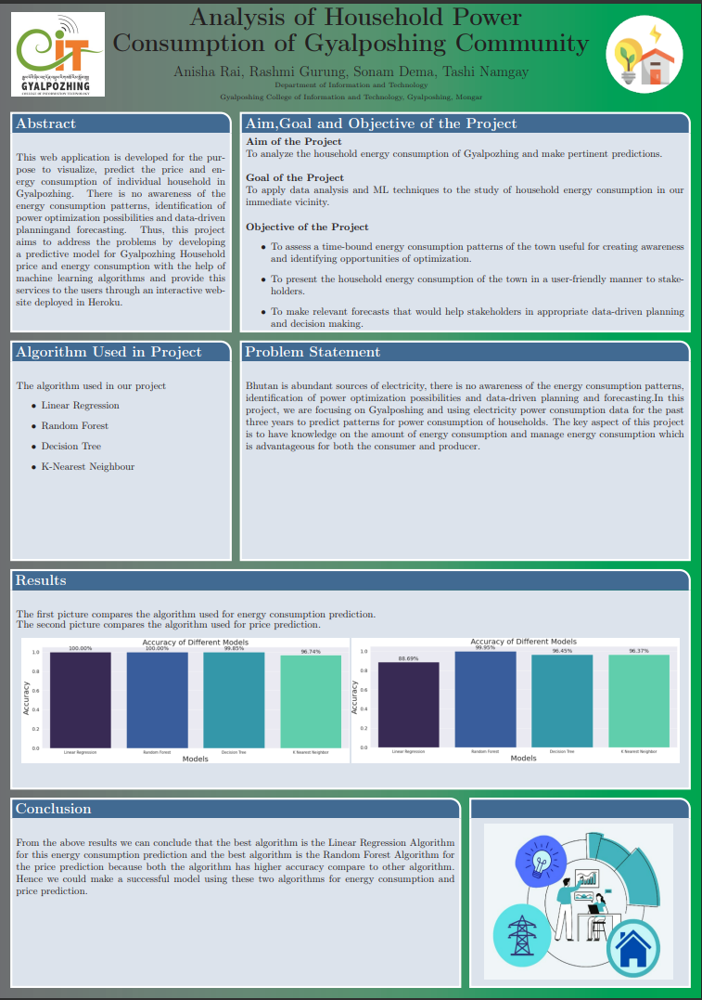
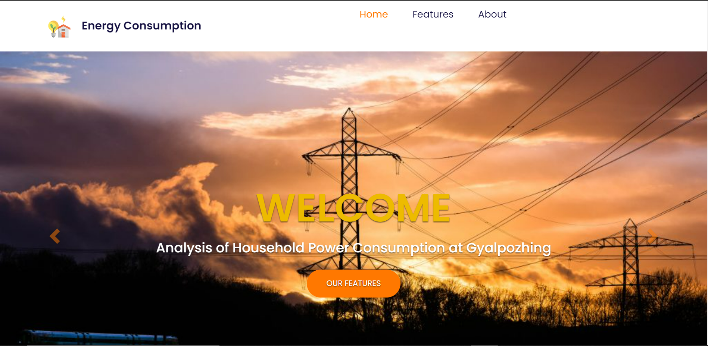
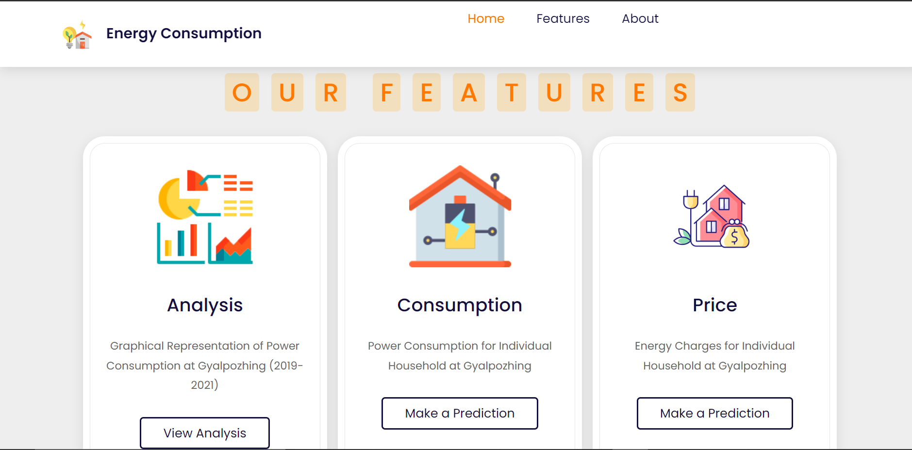
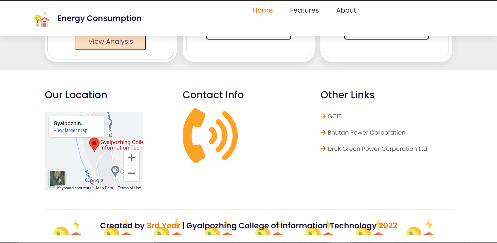
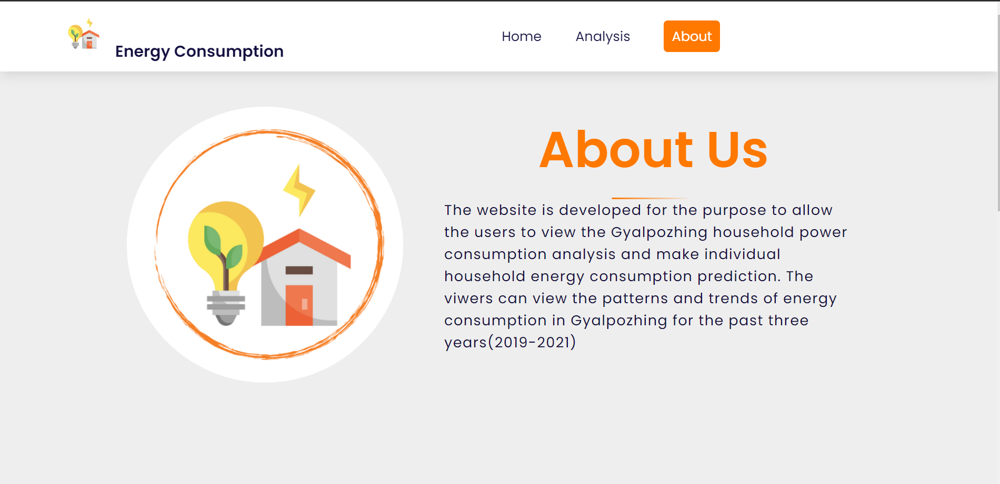
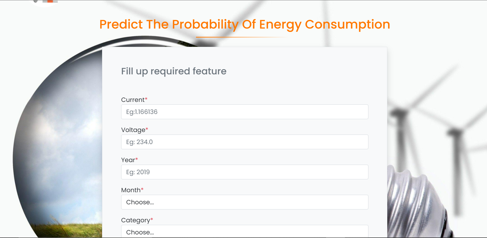
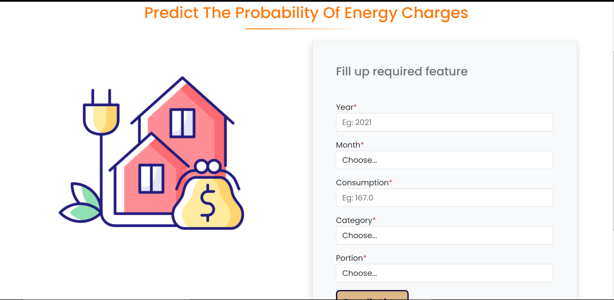

# ANALYSIS OF HOUSEHOLD ENERGY CONSUMPTION AT GYALPOZHING

## INTRODUCTION

This website is developed for the purpose to allow the user to view the Gyalpozhing household power consumption visualization and make individual household energy consumption and price prediction as well. The viewers can view the patterns and trends of the energy consumption in Gyalpozhing for the past three years(2019-2021).

## DATA DESCRIPTION

To analyze the energy consumption of Gyelposhing, the data is acquired from Gyelposhing BPC. The data that is collected in this project is of three years. The attributes that we have selected for this project are as follows:

**1. Category:** Category is the classification of customers that is grouped on the base of the type of consumer they are. For example, companies like RBA are classified as LV Agriculture for it is a company based for Agriculture. There are twelve types of different consumers in the Gyalpozhing community and they are as follows:
- LV Agriculture
- LV Bulk
- LV Institutional
- LV Power house
- LV Religious Institution Customers
- LV Rural Domestic Customers
- LV Rural-Community Lhakhangs
- LV Street light
- LV Temporary
- LV Urban Domestic Customers
- LV Rural-Cooperatives and Agriculture
- MV Industrial

**2. Portion:** Portion in here represents the classification of the area where each customer lies. The areas(such as town, rural,ect) of each household in Gyalpozhing community. The location is mainly divided into two parts which are as follows:
- P17-40
- P17-41

**4. Voltage:** It is the voltage that is being supplied to all the consumers and the value of the voltage is static. 

**5. Current**, **Consumption** and **Energy Charges** are the value that varies from each customer and it also represents the value of each attribute that is consumed by the customer. 

**6. Year** attribute used in this project for three years, from 2019 to 2021. 

**The unit used for voltage is Volt, current is Ampere, consumption is KiloWatt and energy charges are Ngultrum.** 

 

## Website Link

**Please Visit Our Website:** <https://energy-consumption-gcit.herokuapp.com/>

 

## POSTER

&emsp;

&emsp;

 

## PROMOTIONAL VIDEO

**Promotional Video :** <https://m.youtube.com/watch?v=krdGXSkq808&feature=youtube.be>

 

## SCREENSHOTS OF THE WEBSITE

### 1. Home Page
&emsp;

&emsp;
***
&emsp;

&emsp;
***
&emsp;

&emsp;
***
&emsp;

### 2. About Page

&emsp;

&emsp;
***
&emsp;

&emsp;
***
&emsp;

### 3. Energy Consumption Prediction Page

&emsp;

 

### 4. Price Prediction Page

 

 
 
 

## THANK YOU!
